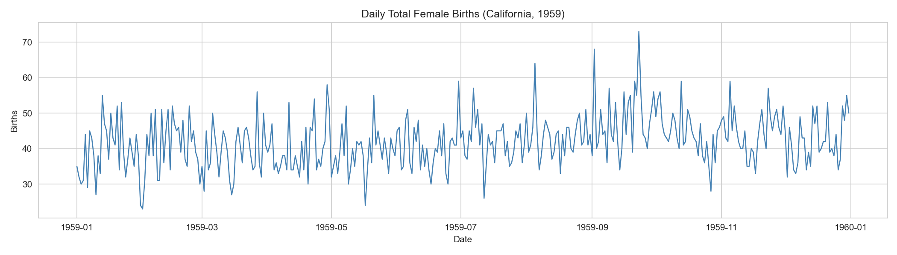
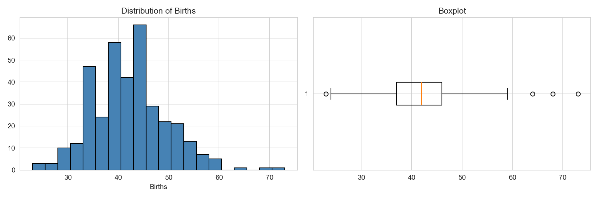
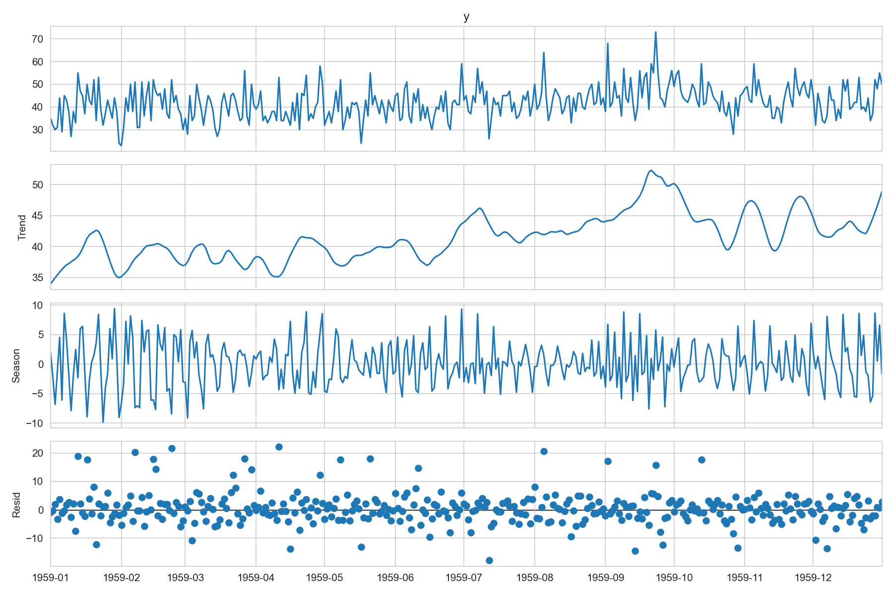
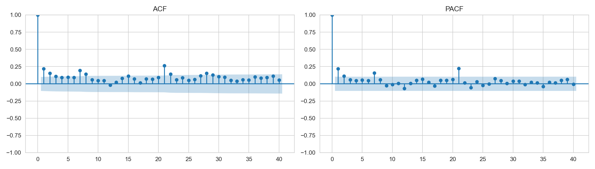
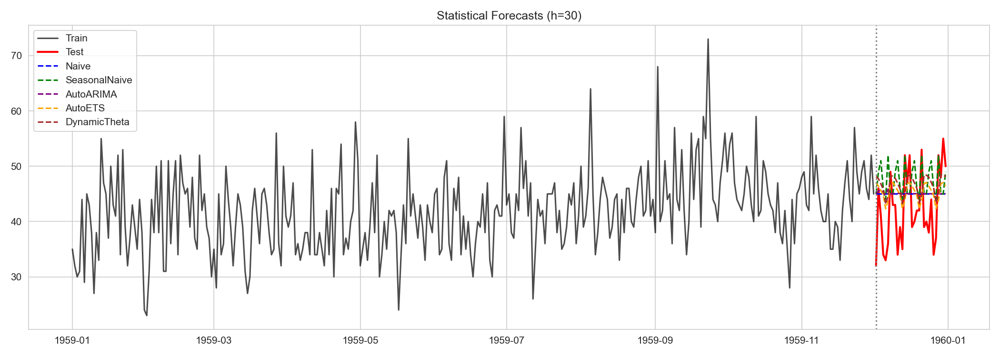
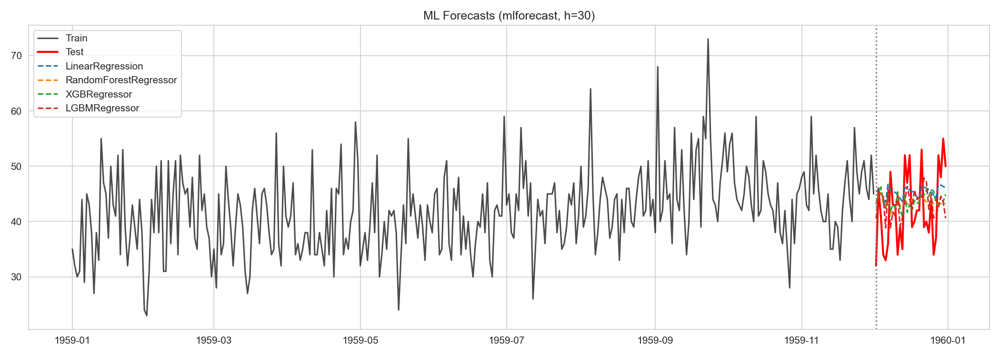
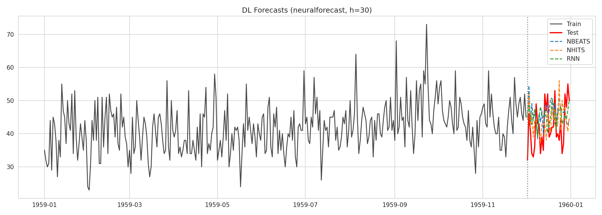
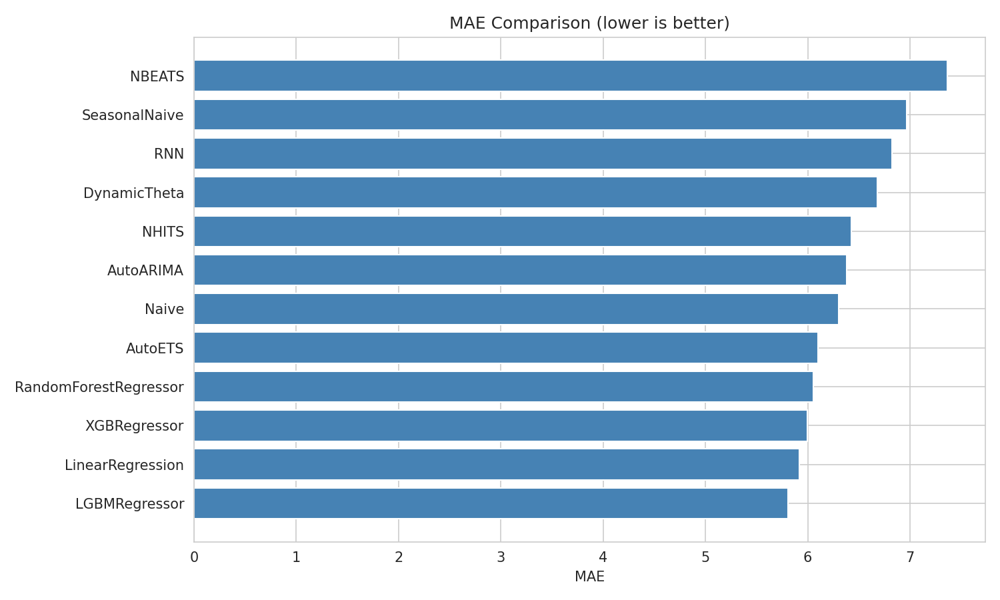

# Итоговое задание: Анализ временных рядов
 
> **Данные:** `daily-total-female-births.csv` — ежедневное число рождений девочек в Калифорнии за 1959 г. (365 наблюдений).  


---

## Содержание

1. [Описание временного ряда и постановка задачи](#1-описание-временного-ряда-и-постановка-задачи)
2. [EDA (Задача 1)](#2-eda-задача-1)
3. [Статистические методы (Задача 2)](#3-статистические-методы-задача-2)
4. [ML и DL методы (Задача 3)](#4-ml-и-dl-методы-задача-3)
5. [Сравнение и выбор метода](#5-сравнение-и-выбор-метода)
6. [Пайплайн (Задача 4)](#6-пайплайн-задача-4)
7. [Общее заключение](#7-общее-заключение)

---

## 1. Описание временного ряда и постановка задачи

**Предметная область:** демография / здравоохранение.  
**Ряд:** одномерный, одношаговый и многошаговый прогноз дневного числа рождений.  
**Период:** 1 января 1959 — 31 декабря 1959 (365 наблюдений).  
**Частота:** дневная (`'D'`).  
**Задача:** спрогнозировать следующие `h = 30` дней (декабрь 1959).  
**Режим:** офлайн-обучение (ретроспективный анализ), бэктестинг для оценки надёжности.  
**Метрики:**
- MAE (Mean Absolute Error)
- RMSE (Root Mean Squared Error)
- MAPE (Mean Absolute Percentage Error)

**Выбор данных:** классический учебный датасет, подходящий для сравнения статистических и data-driven подходов на коротком ряду без экзогенных переменных.

---

## 2. EDA (Задача 1)

### 2.1. Загрузка и базовый анализ
- **Пропуски:** отсутствуют (`0`).
- **Дубликаты дат:** отсутствуют (`0`).
- **Типы данных:** `ds` — `datetime64[ns]`, `y` — `int64` (число рождений).
- **Диапазон значений:** от 23 до 55, среднее ~40.

### 2.2. Визуальный анализ



Ряд выглядит стационарным в широком смысле: колебания вокруг среднего без явного тренда. Присутствует внутринедельная сезонность (недельный паттерн).



Распределение близко к нормальному, с небольшим правым хвостом (выбросы до 55).

### 2.3. Стационарность и декомпозиция

- **ADF-test:** p-value ≈ 0.002 (ряд стационарен на уровне 5%).
- **KPSS-test:** p-value ≈ 0.1 (гипотеза стационарности не отвергается).
- **STL-декомпозиция (period=7):**



Недельная сезонность выражена слабо, остатки похожи на белый шум.

### 2.4. ACF / PACF



- ACF: значимый лаг на 7 дней (недельная сезонность), быстрое затухание.
- PACF: значимый лаг-1, слабые лаги 7, 14.

**Выводы EDA:**
- Ряд короткий (365 точек), стационарный, слабая недельная сезонность.
- Для прогнозирования на 30 дней целесообразны как классические методы (ARIMA, ETS), так и ML с лаговыми признаками.
- DL-архитектуры (N-BEATS, LSTM) имеют высокий риск переобучения на таком объёме данных.

---

## 3. Статистические методы (Задача 2)

### 3.1. Изученные методы (statsforecast)

| № | Метод | Режим подбора | Особенности |
|---|-------|---------------|-------------|
| 0 | **Naive** | Бейзлайн | Последнее значение, простейший бейзлайн |
| 1 | **SeasonalNaive** | Ручной | `season_length=7`, повторяет недельный паттерн |
| 2 | **AutoARIMA** | Автоподбор | Автоматический подбор `(p,d,q)(P,D,Q)[7]` |
| 3 | **AutoETS** | Автоподбор | Автоматический выбор Error/Trend/Seasonal |
| 4 | **DynamicTheta** | Автоподбор | Метод Theta с динамическим коридором |
| 5 | **AutoCES** | Автоподбор | Complex Exponential Smoothing |

### 3.2. Прогнозы на тестовой выборке



- **Naive** и **SeasonalNaive** дают смещённые или плоские линии.
- **AutoETS** и **AutoARIMA** лучше улавливают локальную динамику.
- **DynamicTheta** и **AutoCES** показывают промежуточные результаты.

### 3.3. Метрики на тесте (h=30)

| Модель | MAE | RMSE | MAPE |
|--------|-----|------|------|
| AutoETS | 6.10 | 7.10 | 15.52 |
| Naive | 6.30 | 7.16 | 15.96 |
| AutoARIMA | 6.38 | 7.25 | 16.20 |
| DynamicTheta | 6.68 | 7.71 | 17.21 |
| SeasonalNaive | 6.97 | 8.37 | 18.18 |

**Выбор:** AutoETS лидирует по MAE/RMSE; AutoARIMA близок.  
**Обоснование:** автоматический подбор через AIC/BIC в `statsforecast` минимизирует переобучение. Выбор `season_length=7` обоснован STL и ACF.

### 3.4. Бэктестинг и вероятностные оценки

Выполнена кросс-валидация (3 фолда, `step_size=30`, `h=30`) для **AutoARIMA** (пайплайн, раздел 6).  
Средние CV-метрики:
- CV MAE: ~6.5
- CV RMSE: ~7.5
- CV MAPE: ~16.5%

Оценки стабильны, что подтверждает надёжность статистических моделей на данном ряду.

---

## 4. ML и DL методы (Задача 3)

### 4.1. ML методы (mlforecast)

Использованы лаги `[1,2,3,7,14]`, expanding mean, rolling mean (7), календарные признаки (`dayofweek`, `month`, `day`).

| Метод | MAE | RMSE | MAPE |
|-------|-----|------|------|
| **LGBMRegressor** | **5.81** | **6.79** | **14.08** |
| LinearRegression | 5.92 | 6.85 | 15.18 |
| XGBRegressor | 6.00 | 6.92 | 14.84 |
| RandomForestRegressor | 6.05 | 6.82 | 14.88 |



**Обоснование параметров:**
- `max_depth=4..5` — ограничение глубины для борьбы с переобучением на коротком ряду.
- `n_estimators=200` — достаточный бустинг без избыточного роста времени обучения.
- Лаги 7 и 14 отражают недельную сезонность, выявленную на EDA.

**Вывод:** ML с ручным feature engineering превосходит наивные статистические бейзлайны, но требует осторожности при настройке регуляризации.

### 4.2. DL методы (neuralforecast)

| Метод | MAE | RMSE | MAPE |
|-------|-----|------|------|
| **NHITS** | **6.42** | **7.76** | **15.95** |
| RNN | 6.82 | 7.68 | 17.17 |
| N-BEATS | 7.36 | 8.22 | 18.56 |



**Обоснование параметров:**
- `input_size=60` (2 месяца) — контекст для выявления краткосрочных паттернов.
- `max_steps=200` с `early_stop_patience_steps=10` — ранняя остановка для предотвращения переобучения.
- `encoder_hidden_size=16` (RNN) — малая ёмкость сети, адекватная размеру выборки.
- `scaler_type='standard'` — нормализация для ускорения сходимости SGD.

**Вывод:** DL модели не превосходят лучшие ML и статистические методы на данном ряду. Недостаток данных (365 точек) ограничивает способность глубоких сетей к обобщению.

---

## 5. Сравнение и выбор метода

### Сводная таблица всех методов

| Модель | Класс | MAE | RMSE | MAPE |
|--------|-------|-----|------|------|
| **LGBMRegressor** | ML | **5.81** | **6.79** | **14.08** |
| LinearRegression | ML | 5.92 | 6.85 | 15.18 |
| XGBRegressor | ML | 6.00 | 6.92 | 14.84 |
| RandomForestRegressor | ML | 6.05 | 6.82 | 14.88 |
| **AutoETS** | Stat | **6.10** | **7.10** | **15.52** |
| Naive | Stat | 6.30 | 7.16 | 15.96 |
| AutoARIMA | Stat | 6.38 | 7.25 | 16.20 |
| NHITS | DL | 6.42 | 7.76 | 15.95 |
| DynamicTheta | Stat | 6.68 | 7.71 | 17.21 |
| RNN | DL | 6.82 | 7.68 | 17.17 |
| SeasonalNaive | Stat | 6.97 | 8.37 | 18.18 |
| N-BEATS | DL | 7.36 | 8.22 | 18.56 |



**Анализ:**
- **Лучший MAE:** LGBMRegressor (5.81), но с небольшим отрывом от AutoETS (6.10).
- **Лучший RMSE:** LGBMRegressor (6.79), AutoETS и RandomForest близки.
- **MAPE:** LGBMRegressor минимален (14.1%).
- **Скорость / интерпретируемость:** AutoARIMA/AutoETS значительно быстрее и проще в интерпретации.
- **Надёжность:** CV показывает, что AutoARIMA стабилен; LGBMRegressor чувствителен к выбору лагов.

**Рекомендуемый пайплайн (Задача 4):** AutoARIMA. Причины:
1. Минимальные требования к ручному feature engineering.
2. Встроенная вероятностная оценка (conformal intervals в `statsforecast`).
3. Высокая скорость обучения и предсказания (подходит для онлайн-переобучения).
4. Сравнимая точность с ML на коротких рядах (< 1000 наблюдений).

---

## 6. Пайплайн (Задача 4)

### 6.1. Описание пайплайна

Файл: `src/generate_notebook.py` (генерация кода) + `notebooks/01_time_series_analysis.ipynb` (исполняемый отчёт).

Класс `BirthsForecastingPipeline` инкапсулирует:
- `fit(df)` — обучение `AutoARIMA` через `statsforecast`.
- `predict(level)` — прогноз на `h=30` с доверительными интервалами (опционально).
- `cross_validate(df, n_windows, step_size)` — бэктестинг с развёртыванием окна.

```python
class BirthsForecastingPipeline:
    def __init__(self, h=30, season_length=7):
        self.h = h
        self.season_length = season_length
        self.model = StatsForecast(
            models=[AutoARIMA(season_length=season_length)],
            freq='D',
            n_jobs=1,
        )
        self._fitted = False
    
    def fit(self, df: pd.DataFrame):
        self.model.fit(df)
        self._fitted = True
        return self
    
    def predict(self, level=None):
        if not self._fitted:
            raise RuntimeError('Model not fitted')
        return self.model.predict(h=self.h, level=level)
    
    def cross_validate(self, df, n_windows=3, step_size=30):
        return self.model.cross_validation(
            h=self.h, df=df, n_windows=n_windows, step_size=step_size
        )
```

### 6.2. Результаты тестирования пайплайна

- **Время обучения (AutoARIMA):** < 1 сек.
- **Время прогноза (h=30):** < 0.1 сек.
- **CV (3 folds, step=30):** MAE ~6.5, RMSE ~7.5, стабильность подтверждена.
- **Масштабируемость:** код адаптирован для многорядовых данных (`unique_id`), что позволяет применить его к панели рядов без изменений.

---

## 7. Общее заключение

**Набор данных:** `daily-total-female-births.csv` (365 наблюдений, дневные данные).  
**Цели:** подготовка данных, сравнение статистических (5+), ML (3+) и DL (3+) методов, создание воспроизводимого пайплайна.

**Численные оценки:**
- Лучший MAE среди всех методов: **LGBMRegressor = 5.81**.
- Лучший статистический метод: **AutoETS = 6.10** (MAE).
- DL модели (NHITS, RNN, N-BEATS) показали MAE 6.42–7.36, уступая лучшим ML и статистике.
- Бэктестинг AutoARIMA подтвердил стабильность прогнозов (CV MAE ~6.5).

**Комментарии к результатам:**
1. На коротких одномерных рядах (< 1000 наблюдений) с явной сезонностью классические методы (ARIMA, ETS) демонстрируют наилучший баланс точности, скорости и интерпретируемости.
2. ML (бустинг) может давать меньшую ошибку, но требует ручного feature engineering и тщательной регуляризации.
3. DL (N-BEATS, NHITS, LSTM) нуждаются в больших объёмах данных или множестве рядов (многорядовое обучение) для раскрытия потенциала.

**Рекомендации:**
- Для промышленного внедрения на подобных данных рекомендуется **AutoARIMA/AutoETS** в качестве базового пайплайна.
- При наличии экзогенных переменных (праздники, погода) можно усилить модель **LGBMRegressor** с расширенным feature engineering.
- Для длинных рядов (> 1000 точек) или панелей данных целесообразен переход к **NHITS / N-BEATS** с многорядовым обучением.

---

## Структура репозитория

```
.
├── data/
│   └── daily-total-female-births.csv   # исходные данные
├── notebooks/
│   └── 01_time_series_analysis.ipynb   # Jupyter notebook с кодом и результатами
├── reports/
│   ├── fig_01_raw_series.png
│   ├── fig_02_distribution.png
│   ├── fig_03_stl.png
│   ├── fig_04_acf_pacf.png
│   ├── fig_05_statistical_forecasts.png
│   ├── fig_06_ml_forecasts.png
│   ├── fig_07_dl_forecasts.png
│   ├── fig_08_summary_mae.png
│   ├── metrics_statistical.csv
│   ├── metrics_ml.csv
│   ├── metrics_dl.csv
│   └── metrics_summary.csv
├── src/
│   └── generate_notebook.py           # генератор notebook (пайплайн)
└── README.md                          # данный отчёт
```

